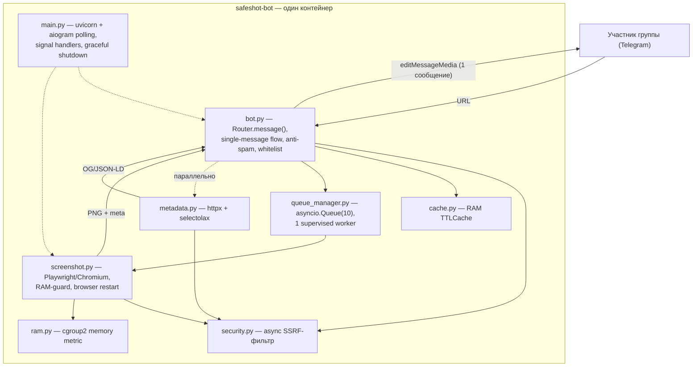
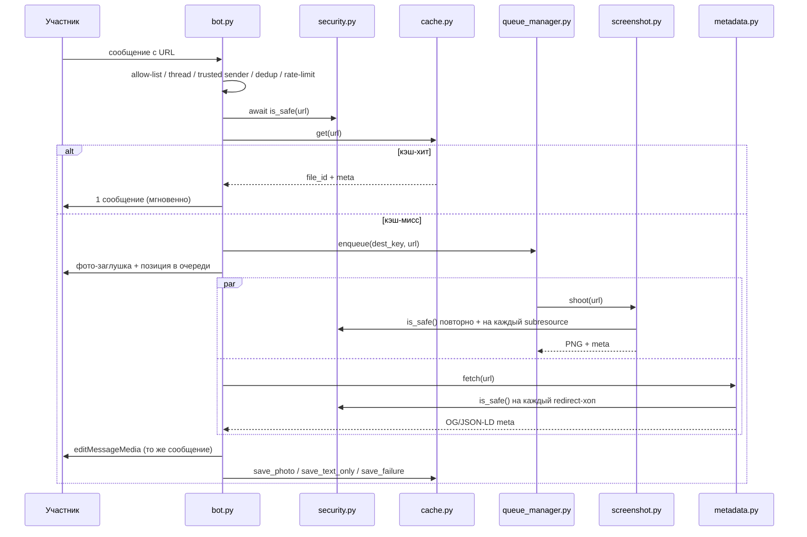
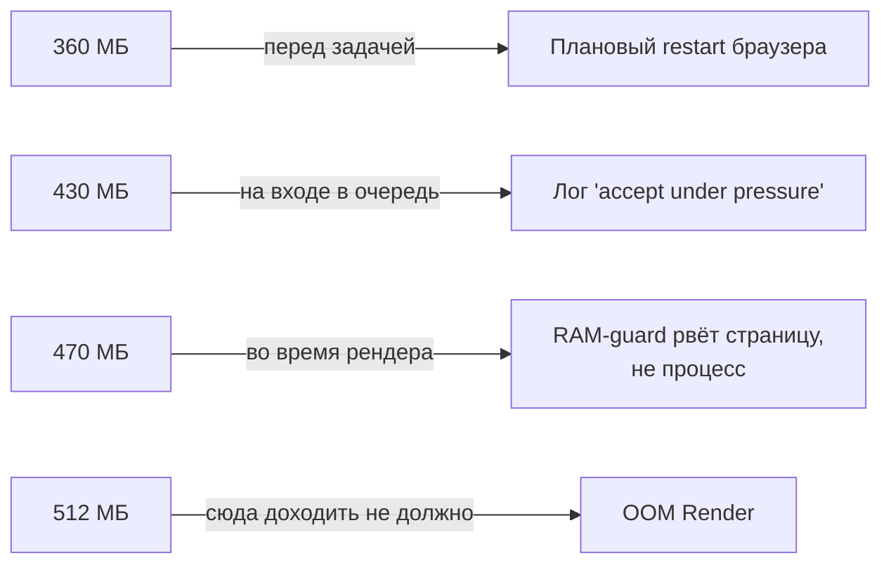

<div align="center">

# 🛡 SafeShot Bot

**Telegram-бот безопасного предпросмотра ссылок для группы.**
Снимает скриншот сайта в изолированном headless-браузере и отвечает карточкой с метаданными — участники видят, куда ведёт ссылка, не переходя по ней.


-46E3B7)


[Возможности](#-возможности) ·
[Архитектура](#-архитектура) ·
[Установка](#-установка) ·
[Деплой](#-деплой) ·
[Конфигурация](#-конфигурация) ·
[Безопасность](#-безопасность) ·
[FAQ](#-faq)

</div>

> **Статус проекта.** Единственная реальная эксплуатация — один инстанс на Render Free (`safeshot-bot.onrender.com`), один контейнер, один maintainer. Весь рантайм-код намеренно откалиброван под лимит **512 МБ RAM**. Любые альтернативные варианты деплоя в этом документе — совместимы технически, но не проверены на этом проекте в бою.

---

## Содержание

- [Возможности](#-возможности)
- [Как это выглядит](#-как-это-выглядит-в-чате)
- [Архитектура](#-архитектура)
- [Структура проекта](#-структура-проекта)
- [Требования](#-требования)
- [Переменные окружения](#-переменные-окружения)
- [Установка](#-установка)
- [Деплой](#-деплой)
- [Конфигурация](#-конфигурация)
- [Мониторинг](#-мониторинг)
- [Логирование](#-логирование)
- [Безопасность](#-безопасность)
- [Troubleshooting](#-troubleshooting)
- [FAQ](#-faq)
- [Roadmap](#-roadmap)
- [Contributing](#-contributing)
- [License](#-license)

---

## ✨ Возможности

Только то, что реально реализовано в коде — без обещаний на будущее (см. [Roadmap](#-roadmap)):

- **Безопасный рендер недоверенного сайта.** Playwright + headless Chromium в non-root контейнере, **полная мобильная эмуляция** (UA + `is_mobile` + `has_touch` + viewport 390×844) — многие анти-боты пропускают мобильный трафик охотнее десктопного.
- **Three-layer SSRF-защита** (`security.py`): проверка на входе → повторно перед навигацией → на **каждый** под-запрос страницы (subresource/iframe/fetch/redirect). Блокирует приватные/loopback/link-local/CGNAT-сети, облачный IMDS (`169.254.169.254`), нестандартные порты, внутренние DNS-суффиксы — для IPv4 и IPv6, включая IPv4-mapped адреса.
- **Метаданные из двух источников.** Параллельно с рендером — `httpx`-fetch (свой набор User-Agent, ручной обход редиректов с SSRF-проверкой на каждый хоп) для OG/JSON-LD; берётся лучший результат из двух.
- **Single-message flow.** Одна ссылка — одно сообщение: фото-заглушка с предупреждением превращается (`editMessageMedia`) в готовый результат. Ничего не удаляется, ничего не плодится повторно.
- **Anti-spam с реальной эскалацией.** Повтор одной ссылки → предупреждение → последнее предупреждение → настоящий `mute` через `restrictChatMember` (5 минут, снимается самим Telegram по `until_date`). Rate-limit на разные ссылки. Анонимные отправители (привязанные каналы) учитываются отдельным ключом — не обходят лимиты. Админы и доверенные отправители — мимо всех ограничений.
- **Whitelist доверенных доменов.** YouTube/Wikipedia/GitHub/соцсети/Rozetka и др. — тихая реакция 👌 вместо обработки (настраивается, см. `TRUSTED_DOMAINS`).
- **Детект Cloudflare-challenge.** Если сайт отдаёт interstitial ("Just a moment...", Turnstile) — бот не тратит ресурсы на бессмысленный скриншот заглушки, а честно показывает карточку "сайт под защитой" с реальным доменом.
- **RAM-инженерия под 512 МБ.** Собственная cgroup-метрика памяти (`ram.py`) — именно то, что видит OOM-killer Render, не наивная сумма RSS. Многоуровневые пороги: плановый restart браузера → soft-warning → mid-render abort конкретной страницы (не всего процесса) → теоретический хард-лимит платформы.
- **RAM-кэш готовых результатов.** Повторная ссылка отвечается мгновенно без повторного рендера (TTL зависит от типа контента — успешный скриншот живёт дольше, чем "не удалось").
- **Self-healing.** Supervised воркер очереди и браузер самовосстанавливаются при сбое без падения всего процесса.
- **Кастомизация графики без правки кода.** Подмена PNG-баннеров по имени файла в корне репозитория.

---

## 🖥 Как это выглядит в чате

1. Участник публикует ссылку → бот мгновенно отвечает компактной заглушкой-предупреждением (780×320).
2. Через 10–90 секунд **то же сообщение** превращается в результат:
   - ✅ успех — скриншот первого экрана страницы + карточка (название/цена/бренд/описание из OG/JSON-LD);
   - ℹ️ скриншот не вышел, но данные есть — мини-баннер + карточка;
   - 🛡 сайт защищён Cloudflare-challenge — честная нейтральная карточка с доменом;
   - ❌ полный фейл — мини-баннер "превью не удалось".
3. Доверенные домены — тихая реакция 👌, без сообщений в ленте.

---

## 🏗 Архитектура

Однопроцессный asyncio-монолит: один контейнер, один Python-процесс, один event loop, в котором сосуществуют aiogram long-polling, uvicorn (health-эндпоинты) и единственный Chromium-инстанс за `asyncio.Semaphore(1)` — параллельный рендер второй страницы физически не запускается, это намеренное ограничение под 512 МБ.



<details>
<summary><b>Sequence-диаграмма одной ссылки (раскрыть)</b></summary>



</details>

### Модель памяти (ключевая инженерная особенность)



Метрика — `memory.current − (file − shmem)` через cgroup2 (`ram.py`): именно то, что видит OOM-killer платформы. Наивная сумма RSS python+chromium даёт ложное завышение на 25–40% из-за shared-страниц Chromium.

---

## 📂 Структура проекта

```
safeshot-bot/
├── main.py                  # Точка входа: FastAPI + aiogram + uvicorn, graceful shutdown
├── bot.py                    # Хендлеры, single-message flow, anti-spam, карточки
├── security.py                # SSRF-фильтр (async)
├── screenshot.py               # Playwright-рендер, RAM-guard, Cloudflare-детект
├── metadata.py                 # httpx-фетч метаданных, ручные редиректы
├── cache.py                    # RAM TTL-кэш готовых результатов
├── queue_manager.py              # Очередь на рендер, supervised worker
├── ram.py                       # cgroup-метрика памяти
├── config.py                     # Вся конфигурация (env + лимиты)
│
├── Dockerfile                    # mcr.microsoft.com/playwright/python:v1.60.0-noble
├── docker-compose.yml              # ТОЛЬКО локальная разработка (Render его не использует)
├── render.yaml                    # Render Blueprint — единственный прод-деплой
├── requirements.in                  # Прямые зависимости (диапазоны версий)
├── requirements.txt                  # Полный hash-pinned lock (35 пакетов)
├── .env.example                      # Шаблон переменных окружения
├── LICENSE                            # MIT
├── .github/workflows/ci.yml             # py_compile + pytest на каждый push/PR
│
├── placeholder.png                      # Заглушка-старт 780×320
├── banner_text.png                       # Баннер "скриншот недоступен"
├── banner_fail.png                        # Баннер "превью не удалось"
├── banner_protected.png                    # Баннер "сайт под Cloudflare-защитой"
│
├── tests/
│   ├── test_security.py                      # Unit-тесты SSRF-фильтра
│   └── test_bot_sender_key.py                 # Regression-тест anti-spam для анонимных sender'ов
├── SECURITY_AUDIT_2026.md                       # Реестр уязвимостей V-01..V-20, статусы
└── PROJECT_STATE.md                              # Внутренний журнал калибровки RAM-порогов
```

---

## 📋 Требования

| Параметр | Значение |
|---|---|
| Python | 3.12 (соответствует прод-образу; локально с Docker — версия хоста не важна) |
| Docker | 24+ (если деплоите через контейнер — рекомендуемый путь) |
| RAM | **минимум 512 МБ** при текущих порогах (`config.py`); комфортно — 1 ГБ+, если не привязаны к Render Free |
| CPU | 1 vCPU достаточно — рендер строго последовательный (`SEMAPHORE=1`) |
| ОС | Любая для Docker-деплоя; для запуска без Docker — Linux рекомендуется (cgroup-метрика `ram.py` имеет fallback на rss-сумму вне Linux/без cgroup) |
| Сеть | Исходящий HTTPS к Telegram API и к произвольным сайтам (рендер); входящий трафик нужен только для anti-sleep на платформах с засыпанием (Render Free) |

---

## ⚙️ Переменные окружения

| Переменная | Обязательна | Default | Описание |
|---|:---:|---|---|
| `BOT_TOKEN` | ✅ | — | Токен от `@BotFather`. Без него процесс не стартует (`fail-fast`) |
| `ALLOWED_GROUP_IDS` | ⚠️* | пусто | Allow-list групп через запятую/пробел (`-100...` для супергрупп) |
| `ALLOW_OPEN_MODE` | ⚠️* | `false` | `true` — бот отвечает в любой группе. **Осознанный риск** (открытый SSRF-прокси без allow-list) |
| `DISABLED_THREADS` | Нет | пусто | Denylist топиков: `group:thread` или `group:general` |
| `TRUSTED_DOMAINS` | Нет | встроенный список | Whitelist доменов (тихая реакция). Пустая строка **явно** отключает whitelist |
| `PORT` | Нет | `8000` | Порт uvicorn |
| `LOG_LEVEL` | Нет | `INFO` | Уровень `loguru` |
| `HEALTH_TOKEN` | Нет | пусто (открыт) | Заголовок `X-Health-Token` для доступа к `/health` |
| `CHROMIUM_SANDBOX` | Нет | выкл | `on` — настоящий Chromium sandbox (нужны user namespaces/seccomp; недоступно на Render Free) |
| `JITLESS` | Нет | выкл | `on` — отключает V8 JIT, режет RCE-поверхность ценой скорости |

\* Нужен **либо** `ALLOWED_GROUP_IDS`, **либо** `ALLOW_OPEN_MODE=true` — иначе процесс падает при старте (secure-by-default).

---

## 🚀 Установка

### Локально (без Docker)

```bash
git clone https://github.com/Tosik017/safeshot-bot.git
cd safeshot-bot
python3 -m venv venv && source venv/bin/activate
pip install -r requirements.txt        # hash-pinned, проверка целостности пакетов включена автоматически
playwright install chromium --with-deps
cp .env.example .env                   # заполните BOT_TOKEN и ALLOWED_GROUP_IDS
python main.py
```

### Docker

```bash
docker build -t safeshot-bot .
docker run -d --name safeshot-bot \
  --env-file .env \
  -p 8000:8000 \
  --memory=512m \
  safeshot-bot
```

### Docker Compose (рекомендуется для локальной разработки)

`docker-compose.yml` включает усиленную изоляцию (`cap_drop: ALL`, `read_only`, `tmpfs`, `mem_limit: 512m` — имитация Render Free) и **не используется на проде** — это инструмент разработчика, не часть прод-пайплайна.

```bash
docker compose up -d --build
```

---

## ☁️ Деплой

### Render (единственный проверенный прод-вариант)

1. New → Blueprint → указать репозиторий (использует `render.yaml`).
2. В Dashboard вручную задать `BOT_TOKEN`, `ALLOWED_GROUP_IDS` (помечены `sync: false` — не хранятся в git).
3. Настроить внешний пингер (UptimeRobot / cron-job.org) на `GET /ping` каждые ~10 минут — Free-плана засыпает без входящего HTTP-трафика.
4. Push в `main` → автодеплой (CI — `.github/workflows/ci.yml` — гоняет `py_compile`+`pytest` на каждый push, но это не блокирует деплой на Render, только сигнализирует). **Важно:** при упавшей сборке Render продолжает крутить предыдущую рабочую версию — "бот отвечает" ≠ "новый код доехал". Маркер свежего кода — формат RAM-логов.
5. Форс-рестарт без нового кода: `git commit --allow-empty -m "restart" && git push`.

> Перед push рекомендуется также локально: `python3 -m py_compile *.py && pytest -q` — быстрее, чем ждать CI.

### Альтернативные варианты (технически совместимы, не проверены на этом проекте)

> ⚠️ Ниже — справочная информация для будущего масштабирования. Текущая прод-версия специально откалибрована под лимит 512 МБ Render Free (`RESTART_AT_MB`/`ABORT_AT_MB`/`DEVICE_SCALE` в `config.py`/`screenshot.py`). Переезд на платформу с большим объёмом RAM не требует немедленных правок кода, но часть защитных порогов станет избыточно консервативной — пересматривать стоит осознанно, с новыми данными по фактическому потреблению.

<details>
<summary><b>VPS (Ubuntu / Hetzner / Oracle Cloud Free Tier)</b></summary>

```bash
git clone https://github.com/Tosik017/safeshot-bot.git && cd safeshot-bot
cp .env.example .env   # заполнить секреты
docker compose up -d --build
```

Для Oracle Cloud Free Tier (ARM Ampere) upstream-образ Playwright публикует отдельный тег `v1.60.0-noble-arm64` — multi-arch манифест `mcr.microsoft.com/playwright/python:v1.60.0-noble` сам выберет нужную архитектуру при `docker build`.
На VPS нет встроенного autoDeploy/healthCheck, как на Render — настройте `systemd`/`watchtower` или CI-деплой по SSH самостоятельно.

</details>

<details>
<summary><b>Coolify</b></summary>

Coolify — open-source self-hosted PaaS-слой (устанавливается на свой VPS, не отдельный хостинг). Создать ресурс типа "Dockerfile", указать репозиторий — Coolify соберёт образ по тому же `Dockerfile`, что и Render. Health check указать на `/ping`.

</details>

<details>
<summary><b>Railway / Fly.io</b></summary>

Обе платформы умеют деплоить напрямую из `Dockerfile` без дополнительной конфигурации (Railway — автоматически; Fly.io — через `fly launch`, который сгенерирует `fly.toml` на основе существующего `Dockerfile`). У обеих платформ нет постоянного бесплатного тарифа уровня Render Free — оценивайте стоимость по факту использования RAM/CPU.

</details>

---

## 🔧 Конфигурация

Все числовые лимиты — константы в `config.py` с обоснованием в комментариях; ниже — практический срез:

| Параметр | Значение | Назначение |
|---|---|---|
| `SEMAPHORE` | 1 | Одновременных рендеров — больше = OOM на 512 МБ |
| `MAX_QUEUE_SIZE` | 10 | Глубина очереди ожидания |
| `MAX_INFLIGHT_PER_CHAT` | 8 | Per-chat квота очереди |
| `TASK_TIMEOUT_SEC` | 90 | Таймаут одной задачи рендера |
| `RATE_LIMIT_SEC` | 5 | Пейсинг разных ссылок от одного отправителя |
| `CACHE_SIZE` | 200 | Максимум записей в RAM-кэше результатов |
| `RESTART_EVERY` | 50 | Плановый restart браузера (сброс V8 heap) |
| `DEVICE_SCALE` | 1.5 | Качество скриншота vs RAM-пик при рендере |

**Кастомизация графики** — положите свой PNG в корень репозитория под нужным именем (`placeholder.png`, `banner_text.png`, `banner_fail.png`, `banner_protected.png`, рекомендуемый размер 1600×656 — 2x от номинальных 780×320 для чёткости в Telegram) — бот подхватит его вместо встроенного Pillow-фолбэка. Смена любого файла = новый деплой (графика зашивается в образ при `COPY . .`).

**Whitelist доменов** по умолчанию: YouTube, Wikipedia, GitHub, Telegram, основные соцсети, Rozetka.com.ua (сайт за Cloudflare-challenge, превью физически не снимается). Переопределяется через `TRUSTED_DOMAINS`.

---

## 📊 Мониторинг

```bash
# /ping — то, что реально гейтит рестарт на Render. НЕ проверяет внутреннее состояние.
curl -s https://<host>/ping

# /health — реальный статус компонентов (опционально за HEALTH_TOKEN)
curl -s -H "X-Health-Token: $HEALTH_TOKEN" https://<host>/health | jq
# {"status":"ok","browser":true,"bot":true,"worker":true}
```

Внешний пингер (UptimeRobot/cron-job.org) на `/ping` нужен **обязательно** на Render Free — иначе инстанс засыпает без входящего HTTP-трафика, даже если бот сам активно работает через polling.

---

## 📝 Логирование

`loguru` → `stderr`, без `diagnose/backtrace` — намеренно, чтобы значения переменных (URL, токены) не попадали в трейсбэк необработанного исключения. Ротация/агрегация не настроены — на Render логи хранятся платформой. При самостоятельном хостинге (VPS) добавьте при необходимости:

```python
logger.add("logs/bot.log", rotation="10 MB", retention="7 days", compression="zip")
```

---

## 🔒 Безопасность

Полный и непрерывно обновляемый реестр — [`SECURITY_AUDIT_2026.md`](./SECURITY_AUDIT_2026.md) (V-01..V-20, CWE-классификация, статусы FIXED/ACCEPTED/PARTIAL).

Кратко, реализовано:

- **Three-layer SSRF-фильтр** — вход / повторно перед рендером / на каждый под-запрос страницы.
- **Async DNS-резолв** — не блокирует event loop под нагрузкой.
- **Hash-pinned зависимости** (`pip install --require-hashes`) — `pip-audit` подтверждает 0 известных CVE на весь граф из 35 пакетов на момент последней проверки.
- **Non-root контейнер** (`pwuser`), graceful shutdown, fail-fast при отсутствии `BOT_TOKEN`.
- **Secure-by-default allow-list** групп — бот сам покидает чаты не из списка.
- **CI** — `py_compile` + `pytest` на каждый push/PR (`.github/workflows/ci.yml`).

Осознанно принятые риски:

- Chromium запускается с `--no-sandbox` — Render Free не предоставляет user namespaces/seccomp. Смягчено non-root пользователем контейнера. На VPS с поддержкой seccomp — `CHROMIUM_SANDBOX=on`.
- Базовый Docker-образ закреплён по тегу, не по digest.

**Сообщить об уязвимости:** выделенного security-контакта/`SECURITY.md` пока нет — откройте Issue с минимумом деталей в публичном описании или свяжитесь с мейнтейнером напрямую через GitHub.

---

## 🛠 Troubleshooting

<details>
<summary><b>Бот "висит" дольше минуты на одной ссылке</b></summary>

Один воркер, один Chromium (`SEMAPHORE=1`) — при всплеске активности хвост очереди ждёт 60–100 секунд. Карточка-заглушка показывает позицию в очереди. Это физика Free-тарифа, не баг.

</details>

<details>
<summary><b>После пуша бот ведёт себя по-старому</b></summary>

Render продолжает крутить предыдущую успешно собранную версию, если новый деплой упал. Проверьте Dashboard → последний деплой → логи сборки. Маркер свежего кода — формат RAM-логов в выводе.

</details>

<details>
<summary><b>Ссылка на сайт с Cloudflare показывает "сайт под защитой" вместо скриншота</b></summary>

Это намеренное поведение (`_is_cloudflare_challenge` в `screenshot.py`) — обход challenge headless-браузером с датацентрового IP физически невозможен (IP-репутация + fingerprinting). Бот честно сообщает об этом вместо мусорного скриншота "Verifying...".

</details>

<details>
<summary><b>"Бот зараз перевантажений (черга заповнена)"</b></summary>

`MAX_QUEUE_SIZE=10` или `MAX_INFLIGHT_PER_CHAT=8` достигнут. Подождите минуту — задачи разгружаются последовательно.

</details>

<details>
<summary><b>Реакция 👌 на доверенные домены не появляется</b></summary>

Reaction API Telegram разрешает только фиксированный набор эмодзи. Убедитесь, что 👌 разрешён в настройках реакций группы.

</details>

---

## ❓ FAQ

<details>
<summary><b>Почему не используется стандартное превью Telegram?</b></summary>

Сайты могут подделывать OG-теги под легитимные, а в группах с отключёнными линк-превью этого механизма нет вообще. Собственный рендер — единственный способ показать, что реально на странице.

</details>

<details>
<summary><b>Зачем такая агрессивная экономия RAM?</b></summary>

Проект развёрнут на Render Free — жёсткий лимит 512 МБ на один Chromium-инстанс плюс Python-процесс. Каждый порог (`RESTART_AT_MB`, `ABORT_AT_MB`, `DEVICE_SCALE`) — результат реальной калибровки по логам, а не произвольное число (история — в `PROJECT_STATE.md`).

</details>

<details>
<summary><b>Можно подключить бота сразу к нескольким большим группам?</b></summary>

Технически — да (allow-list поддерживает несколько ID), но throughput жёстко ограничен одним последовательным воркером. При высокой суммарной активности нескольких групп очередь будет регулярно упираться в `MAX_QUEUE_SIZE`.

</details>

<details>
<summary><b>Почему Chromium запускается без sandbox?</b></summary>

Render Free не предоставляет user namespaces — настоящий Chromium sandbox требует их. Риск смягчён запуском от non-root пользователя контейнера. На своей VPS с seccomp-профилем включите `CHROMIUM_SANDBOX=on`.

</details>

<details>
<summary><b>Что происходит с кэшем/очередью при редеплое?</b></summary>

Всё в RAM процесса — теряется. Это сознательное решение: проект не использует внешнюю БД/Redis, чтобы не увеличивать ресурсный и операционный след на бесплатном тарифе.

</details>

<details>
<summary><b>Почему main.py использует FastAPI для трёх простых JSON-роутов?</b></summary>

Оценивали замену на голый Starlette/ASGI ради экономии веса зависимостей. Фактический выигрыш — около 3-9 МБ диска/RAM (pydantic+pydantic-core+starlette), что незначимо на фоне Chromium (сотни МБ) и риска трогать `main.py` — файл с тщательно откалиброванным graceful shutdown и signal-handling. Решение: оставить как есть.

</details>

---

## 🗺 Roadmap

Основано на реальном эксплуатационном backlog (`PROJECT_STATE.md`) и проведённом security/infra-аудите — не план маркетинговых фич.

**Желательно:**
- [ ] Регрессионные тесты для `queue_manager.py`/`cache.py` (сейчас тестами покрыты только `security.py` и `bot._sender_key`)
- [ ] Структурированное (JSON) логирование — пригодится при будущем переезде на платформу без встроенного лог-вьюера

**Не планируется (осознанно):**
- Горизонтальное масштабирование (требует переноса state из RAM во внешнее хранилище — не нужно при текущем масштабе)
- Redis/БД, метрики Prometheus — избыточны для одного инстанса на 512 МБ
- Замена FastAPI на голый ASGI — оценено, выигрыш не оправдывает риск (см. FAQ)

**Закрыто 2026-06-22** (для истории — было критичным до этой сессии): отсутствие `LICENSE`, отсутствие CI, устаревший `PROJECT_STATE.md`, аномально большой `banner_text.png` (5.2 МБ → 1.2 МБ), отсутствие regression-теста на anti-spam для анонимных sender'ов.

---

## 🤝 Contributing

Соло-проект. Если хотите предложить изменение:

1. Откройте Issue с описанием проблемы/предложения.
2. Перед PR прогоните локально: `python3 -m py_compile *.py && pytest -q` (то же самое прогонит CI на самом PR).
3. Изменения в RAM-порогах (`config.py`, `screenshot.py`) — только с приложенными данными калибровки (логами потребления), без них любой PR в эту область будет отклонён по умолчанию: пороги уже один раз настрадали ценой реальных OOM-инцидентов.

---

## 📄 License

[MIT](./LICENSE) © 2026 Tosik017

</div>
